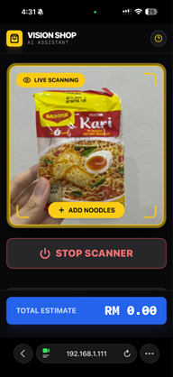
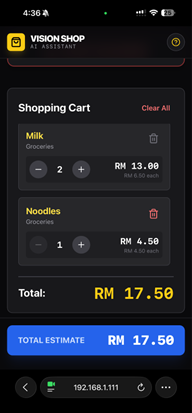

# 🛒 Vision Shop Assistant
### AI-Powered Shopping Assistant for the Visually Impaired

**Vision Shop** is a full-stack real-time assistive application designed to help visually impaired individuals shop independently. It uses **Computer Vision (YOLOv8)** to detect grocery items via a mobile camera, provides instant **Voice Feedback (TTS)**, and automatically tracks the **Total Expense** in real-time.

---

## 📱 Project Demo & Screenshots

| **Live Scanning (Object Detection)** | **Smart Shopping Cart** |
|:------------------------------------:|:-----------------------:|
|  |  |
| *YOLOv8 identifying items with >50% confidence* | *Real-time total calculation & item management* |

> **🎥 [Watch the Full Demo Video Here](https://drive.google.com/file/d/1eTnYDaSC95RT1rvsUrJXuN4dPiUrXzcv/view?usp=sharing)**

---

## 🚀 Key Features

* **👁️ Real-Time Object Detection:** Utilizes a custom-trained **YOLOv8** model to identify 24+ grocery categories with 85% mAP.
* **🗣️ Auditory Guidance:** Implements a **Priority Queue Text-to-Speech (TTS)** system to announce item names and prices instantly without audio overlap.
* **💰 Automated Expense Tracking:** Automatically calculates the total bill in Ringgit Malaysia (RM) as items are scanned.
* **⚡ Low-Latency Architecture:** Optimized client-server communication achieves a **~1.2s response time** over local WiFi.
* **🔒 Secure Mobile Access:** Implements **Ad-hoc SSL/HTTPS** to bypass browser security blocks and enable camera hardware access on mobile devices.

---

## 🛠️ Tech Stack

**Frontend (Mobile Interface):**
* React.js
* TypeScript
* Tailwind CSS
* Web Speech API (TTS)

**Backend (AI Processing):**
* Python (Flask)
* Ultralytics YOLOv8
* Pillow (Image Processing)
* OpenSSL (Security)

---

## 💡 Technical Highlights (Engineering Challenges)

### 1. Client-Server Architecture over LAN
Connecting a mobile frontend to a local laptop backend presented significant networking challenges. I configured the Flask server to host on `0.0.0.0` and implemented dynamic IP bridging, allowing the mobile React app to communicate with the Python backend via REST API over a local WiFi network.

### 2. Solving the "Secure Context" Camera Block
Modern mobile browsers (Chrome/Safari) block camera access on insecure (`http://`) connections. To resolve this without deploying to a public server, I implemented an **Ad-hoc SSL Context** in Python, forcing a secure `https://` connection on the local network to legally unlock the mobile camera hardware.

### 3. Latency Optimization
To ensure a fluid user experience, I engineered an **Auto-Capture Loop** that snapshots video frames every 0.5 seconds. These are converted to optimized Base64 strings and processed asynchronously, keeping the UI responsive while the heavy AI inference runs in the background.

---

## ⚙️ Installation & Setup

If you wish to run this project locally, follow the steps below.

### Prerequisites
* Node.js (v18+)
* Python (v3.9+)
* Webcam or Mobile Phone connected to the same WiFi

### Step 1: Backend Setup (The Brain)
```bash
// Navigate to project folder
// Install dependencies
pip install flask flask-cors ultralytics pillow pyopenssl

// Run the Server
python server.py
// Expected Output: "Running on https://0.0.0.0:5000"
```

### Step 2: Frontend Setup (The Body)
```bash
// Open a new terminal
// Install dependencies
npm install

// Run the React App
npm run dev
```

### Step 3: Network Configuration (Crucial for Mobile)
1.  Find your laptop's local IP address (e.g., Run `ipconfig` or `ifconfig`).
2.  Open `src/services/yoloService.ts`.
3.  Update the API URL:
```bash
    // const response = await fetch('https://YOUR_LAPTOP_IP:5000/detect', { ... });
```

5.  Open the local URL (e.g., `https://192.168.1.X:3000`) on your mobile phone.
6.  **Note:** You must accept the "Unsafe Certificate" warning (Advanced -> Proceed) because we are using a self-signed local certificate.

---

## 📂 File Structure
* `server.py` - Flask server handling image reception and YOLO inference.
* `model.pt` - Custom trained YOLOv8n model weights.
* `src/App.tsx` - Core React application logic (Camera loop & State management).
* `src/services/yoloService.ts` - Handles API communication with the backend.
* `src/components/CameraFeed.tsx` - Manages hardware access and video stream.

---

*Project developed by **Lim Kah Chun** (Lead Developer & System Integrator).*
